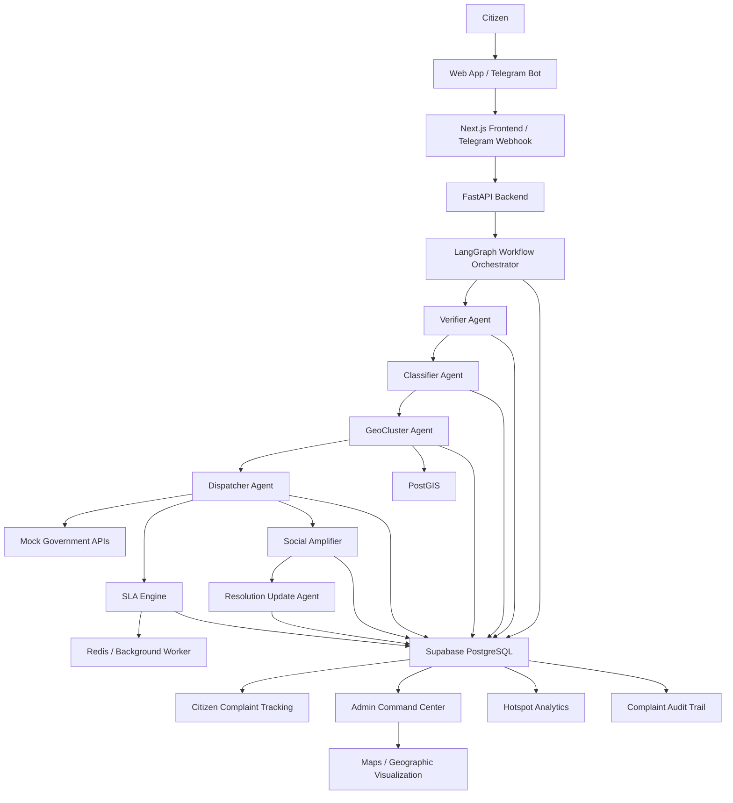

# BarathSeva AI — Autonomous Civic Complaint Intelligence Platform

BarathSeva AI is an AI-powered civic complaint intelligence platform that lets citizens report civic problems — potholes, water leaks, drainage issues, streetlight failures, power outages — using nothing more than a natural-language message, a photo, and a location.

Instead of forcing citizens to navigate multiple government portals and manually work out which department should receive a complaint, BarathSeva AI processes the report automatically. The system verifies the complaint, understands and classifies the issue, identifies the geographic ward and nearby complaint clusters, determines the responsible government department, creates a service ticket, starts SLA tracking, detects hotspots, and generates public accountability updates.

The prototype targets **Bengaluru** first and is architected so it can later scale to other Indian cities.

> **One citizen message should be enough to start the complete civic complaint workflow.**

> **Repository status:** This repository currently holds the project documentation and license. The architecture below describes the system BarathSeva AI is being built to; components are documented as designed, not as deployed.

---

## 1. Problem Statement

### Citizen-side problems

Citizens routinely encounter civic issues in their immediate surroundings:

- potholes and road damage
- water leaks and burst pipelines
- drainage and sewage problems
- garbage accumulation
- streetlight failures
- electricity and power outages
- other local infrastructure faults

Reporting these issues, however, is fragmented across departments and channels. Roads, water, drainage, waste, and electricity are typically owned by different agencies, each with its own portal, helpline, app, or walk-in process. Before a citizen can report anything, they are implicitly asked to perform a triage task that belongs to the government: *which authority owns this problem?*

Even once a channel is chosen, the citizen is usually asked to translate what they can plainly see into a structured form — category dropdowns, ward identifiers, zone codes, address fields — and after submission they often have limited visibility into what happened next.

The core problem is therefore not complaint *submission*. Forms and helplines already exist. The missing piece is a **single intelligent complaint-to-resolution pipeline**: one entry point that absorbs an unstructured citizen report and carries it, end to end, through verification, classification, geographic mapping, departmental routing, ticketing, SLA monitoring, and resolution communication.

### Government-side problems

On the administrative side, handling a single complaint can involve a long chain of manual steps:

- receiving reports across multiple intake channels
- manually reading and interpreting free-text or verbal descriptions
- identifying which department is actually responsible
- determining the responsible ward or zone from an address or landmark
- routing the complaint to the right team
- following up on tickets that have not progressed
- tracking SLA deadlines and escalating breaches
- recognising that several reports describe the same recurring problem in the same locality

Each step is individually small and individually error-prone. Together they create significant operational overhead, and because the work is spread across channels and departments, it is difficult to maintain a **unified, current view of civic issues across a city** — the view required to spot hotspots, allocate crews, or measure where service is failing.

### Transparency problem

Complaint transparency is usually all-or-nothing. After submitting a report, a citizen generally needs — and often cannot easily get — answers to a short, concrete list of questions:

- Was the complaint received?
- Was it verified as a genuine civic issue?
- Which department now owns it?
- What is the ticket or reference number?
- What is the current status?
- What is the SLA deadline for this category of issue?
- Has the issue actually been resolved?

Without durable answers to these, accountability depends on persistence rather than on the system. Status that cannot be observed cannot be trusted, and a complaint whose state is invisible is indistinguishable from a complaint that was never filed.

### The BarathSeva AI solution

BarathSeva AI converts an unstructured citizen report into a tracked, routed, deadline-bound municipal work item:

```text
Citizen report → Verified complaint → Classification → Geographic mapping
    → Department routing → Ticket → SLA monitoring → Resolution
```

The citizen supplies what they naturally have — a sentence, a photo, a location. The platform supplies everything the government process requires: validity assessment, category and severity, ward resolution, cluster and hotspot context, the responsible department, a service ticket, an SLA clock, escalation on breach, and a public, auditable record of state changes.

---

## 2. Solution Overview

A complaint enters through the web app or a Telegram bot, is received by the FastAPI backend, and is then carried through a LangGraph workflow composed of specialized nodes. Every node writes its decision and output to PostgreSQL, which is the system's source of truth and the substrate for citizen status views, the admin dashboard, hotspot analytics, and the audit trail.

```text
Citizen
   |
   | Text + Photo + Location
   v
Web / Telegram
   |
   v
FastAPI Backend
   |
   v
LangGraph Workflow
   |
   +--> Verifier
   |
   +--> Classifier
   |
   +--> GeoCluster
   |
   +--> Dispatcher
   |
   +--> Social Amplifier
   |
   +--> Resolution Update
   |
   +--> SLA Monitor
   |
   v
Supabase PostgreSQL + PostGIS
   |
   +--> Citizen Status
   +--> Admin Dashboard
   +--> Hotspot Analytics
   +--> Audit Trail
```

The important architectural choice is that this is a **controlled workflow of specialized agents and service nodes**, not a single LLM given free rein over the system. Each node has one narrow job, a defined input and output contract, and a recorded result. The workflow graph — not a model's improvisation — decides what runs next, so complaint handling is reproducible, inspectable, and safe to operate on real municipal data.

> **LangGraph handles orchestration, AI models provide reasoning, Python handles deterministic business rules, and PostgreSQL/PostGIS acts as the source of truth.**

---

## 3. System Architecture



### Component responsibilities

**Citizen intake — Web App / Telegram Bot.** Two entry points over one backend contract. The Next.js web app handles browser reporting and complaint tracking; the Telegram bot serves citizens who would rather send a message than install anything. Both collect the same payload — text, optional photo, location — and both normalise into a single complaint intake schema, so intake channels can be added later without touching the pipeline.

**Next.js frontend / Telegram webhook.** The frontend renders the citizen reporting flow, complaint status pages, and the admin command center. The Telegram webhook is a thin translation layer from Telegram update objects into the same intake call the web app makes.

**FastAPI backend.** The single API surface and trust boundary. It validates and coerces incoming payloads with Pydantic models, persists the uploaded photo, creates the initial complaint row, assigns the public complaint reference, and hands execution to the workflow orchestrator. Authorization, rate limiting, and request validation belong here rather than inside the agents.

**LangGraph workflow orchestrator.** The control plane. It defines the complaint-processing graph — which node runs, in what order, under which conditions — and carries typed state between nodes. Because the graph is explicit, a complaint's path is deterministic and replayable: the same state produces the same traversal, and a failed or low-confidence node can route to a fallback edge instead of stalling the complaint.

**Verifier agent.** The first gate. Using the text and image together, it judges whether the report describes a genuine civic issue and whether the evidence is sufficient to act on. Its job is to keep noise, duplicates of the obviously invalid kind, and empty submissions out of the municipal queue — and, crucially, to record *why* it decided what it decided.

**Classifier agent.** Determines the complaint category (pothole, water leak, drainage, garbage, streetlight, power outage, and so on) and assigns a severity/priority. The model proposes; deterministic business rules constrain the final value, so priority remains explainable and consistent with policy rather than varying with phrasing.

**GeoCluster agent.** Resolves the submitted coordinates to a ward using PostGIS boundary containment, then queries for nearby complaints within a radius and time window to attach cluster context: how many related reports exist, whether this location is a repeat offender, whether it qualifies as a hotspot. The geometry is computed in the database; AI is used only to summarise the resulting picture in human terms.

**Dispatcher agent.** Maps the resolved category and ward to the responsible department (for Bengaluru: BBMP for roads and solid waste, BWSSB for water and sewerage, BESCOM for electricity), then creates the service ticket against that department's API and stores the returned reference. This is deterministic rule and integration logic — a department mapping must never be a guess.

**Mock government APIs.** Stand-in services that emulate municipal ticketing endpoints for the prototype, so the full lifecycle can be demonstrated end to end without depending on live government systems. They sit behind the same interface real integrations would implement.

**SLA engine + Redis / background worker.** On dispatch, the SLA engine computes a deadline from the SLA policy for that category and priority, and schedules the checks. The background worker wakes on those deadlines, re-reads complaint state, and escalates anything overdue. Timers and escalation thresholds are pure application logic.

**Social amplifier.** For complaints that meet defined eligibility rules — severity, cluster size, SLA breach — it drafts public accountability content. Policy rules decide *whether* a post is warranted; the model only decides *how to word it*.

**Resolution update agent.** When a complaint closes, it generates the citizen-facing and public resolution message, so the loop ends with a readable explanation of what was done rather than a bare status code.

**PostGIS.** Powers every geospatial operation: ward boundary lookup, radius search for nearby complaints, and hotspot aggregation. Keeping spatial logic in the database means the same geometry answers the pipeline, the dashboard, and the analytics views.

**Supabase PostgreSQL.** The source of truth. Every complaint, state change, and agent decision is persisted here; no pipeline state lives only in memory or only in a model's context. Supabase Realtime pushes changes to subscribed clients, which is what makes the admin view update live.

**Citizen complaint tracking.** The public-facing read of a complaint's record: reference number, verification outcome, assigned department, status, SLA deadline, and resolution — the transparency list from the problem statement, answered from stored state.

**Admin command center + maps.** The operational view for officials: incoming complaints, filters by ward, department, category, priority and SLA status, escalations, and a geographic visualization of open issues and clusters.

**Hotspot analytics.** Aggregate spatial and temporal queries that surface recurring problem locations — the view that turns a stream of individual complaints into actionable maintenance signal.

**Complaint audit trail.** An append-only event history per complaint, plus a record of every agent run. Any state a citizen or officer sees can be traced back to the decision that produced it.

---

## 4. Specialized Agent Architecture

| Component               | Responsibility                                                                       | AI / Deterministic                  |
| ----------------------- | ------------------------------------------------------------------------------------ | ----------------------------------- |
| Pipeline Manager        | Controls complaint workflow                                                          | Deterministic / LangGraph           |
| Verifier Agent          | Determines whether the report contains a genuine civic issue and sufficient evidence | AI                                  |
| Classifier Agent        | Identifies complaint category and severity                                           | AI + business rules                 |
| GeoCluster Agent        | Maps coordinates to ward and identifies nearby complaints/hotspots                   | PostGIS + optional AI summarization |
| Dispatcher Agent        | Determines responsible department and creates service ticket                         | Deterministic rules + APIs          |
| SLA Monitor             | Tracks deadlines and escalates overdue complaints                                    | Deterministic                       |
| Social Amplifier        | Generates public accountability content for eligible complaints                      | AI + policy rules                   |
| Resolution Update Agent | Generates citizen/public resolution messages                                         | AI                                  |

Not every "agent" in this architecture needs to be an LLM, and treating them uniformly would be a design error. An agent here is a node with a single responsibility and a recorded output; whether it reaches that output by model inference, a SQL query, or a rule table is an implementation detail chosen per node.

> Geographic calculations, SLA timers, department mappings, ticket creation, and escalation rules should be enforced by deterministic application logic.

A ward boundary is a polygon containment test, not an opinion. An SLA deadline is arithmetic. A department mapping is a lookup that must be correct every time, because a misrouted complaint is worse than an unrouted one. Reserving AI for genuinely ambiguous, unstructured judgment — and keeping it out of anything that must be exact, auditable, or legally defensible — is what makes the pipeline trustworthy enough to run unattended.

---

## 5. Technology Stack

### Frontend
- Next.js
- TypeScript
- Tailwind CSS

### Backend
- FastAPI
- Python
- Pydantic

### AI Orchestration
- LangGraph

### AI Models
- OpenAI or Gemini multimodal models
- The model layer is kept provider-agnostic where practical, so providers can be swapped per node without pipeline changes

### Database
- Supabase
- PostgreSQL
- PostGIS

### Background Processing
- Redis
- Celery or an equivalent background worker

### Realtime
- Supabase Realtime

### Messaging
- Telegram Bot API

### Maps
- Mapbox or Google Maps

### Storage
- Supabase Storage

### Prototype Integrations
- Mock BBMP API
- Mock BWSSB API
- Mock BESCOM API

Government connectivity in the prototype is served entirely by mock APIs. Real municipal integrations with BBMP, BWSSB, BESCOM, or any other agency are a **future production-stage concern** and are not represented as integrated; they require formal access, credentials, and agreements that this project does not claim to hold.

---

## 6. End-to-End Complaint Lifecycle

```text
Citizen:
"Large pothole near Koramangala 5th Block"

+ Photo
+ GPS coordinates

        ↓

Complaint Created
BRS-000001

        ↓

Verifier
Valid civic issue

        ↓

Classifier
Category: POTHOLE
Priority: P2

        ↓

GeoCluster
Ward: Koramangala
Nearby complaints: 6

        ↓

Dispatcher
Department: BBMP
Ticket: BBMP-XXXX

        ↓

SLA Monitor
SLA deadline created

        ↓

Admin Dashboard
Complaint visible in real time

        ↓

Issue resolved

        ↓

Resolution Update
Citizen receives resolution status
```

Identifiers such as `BRS-000001` and `BBMP-XXXX`, along with the ward name, nearby-complaint count, and priority shown above, are **illustrative examples only** — they demonstrate the shape of the lifecycle, not recorded results.

What the walkthrough shows is the scope of what a single sentence plus a photo sets in motion: the citizen performs one action, and verification, categorisation, ward resolution, cluster analysis, departmental routing, ticket creation, deadline tracking, and resolution notification all follow without further human triage.

---

## 7. Data Architecture

```text
users
complaints
complaint_events
agent_runs
departments
wards
sla_policies
social_posts
```

| Entity | Purpose |
| ------ | ------- |
| `users` | Citizens and administrative users — identity, contact channel (including Telegram), and role. |
| `complaints` | The primary complaint record: description, media reference, location, category, priority, ward, assigned department, external ticket reference, status, and SLA deadline. |
| `complaint_events` | Append-only history of everything that happened to a complaint — created, verified, classified, routed, escalated, resolved — with actor and timestamp. |
| `agent_runs` | One row per agent/node execution: input state, output, confidence, status, latency, and model or rule version used. |
| `departments` | Municipal agencies and the categories they own, forming the routing table the dispatcher resolves against. |
| `wards` | Ward and zone records with geographic boundary geometry. |
| `sla_policies` | Resolution deadlines and escalation thresholds per category and priority. |
| `social_posts` | Public accountability content generated for eligible complaints, with its publication state. |

Key properties of this model:

- **`complaints` is the primary complaint record** — the single row every view, ticket, and notification refers back to.
- **`complaint_events` maintains an audit trail** — an append-only log, so complaint history is reconstructable and status is never a value whose origin is unknown.
- **`agent_runs` records agent decisions, status, latency, and outputs** — making the pipeline observable: which node decided what, how confident it was, how long it took, and what it emitted.
- **`wards` contains geographic boundaries** — authoritative ward geometry, so ward assignment is a spatial fact rather than a parsed address string.
- **PostGIS handles geospatial queries** — boundary containment, radius searches for nearby complaints, and hotspot aggregation all execute in the database.
- **`sla_policies` contains deterministic SLA rules** — deadlines are derived from stored policy, so they are consistent, explainable, and changeable without touching pipeline code.

---

## 8. Design Principles

### AI for reasoning

AI handles the parts of the problem that are genuinely unstructured:

- natural-language understanding
- image interpretation
- complaint classification
- summarization
- public-message generation

### Code for enforcement

Application logic owns everything that must be exact and repeatable:

- SLA calculation
- department mapping
- geographic calculations
- authorization
- ticket creation
- state transitions
- escalation rules

### Database as source of truth

All complaint states and events are persisted in PostgreSQL. No pipeline state exists only in process memory or only in a model's context; if it matters, it is a row.

### Auditable agents

Every important AI decision is recorded in `agent_runs` or `complaint_events`, with its inputs, output, and confidence — so any outcome can be explained after the fact rather than reconstructed by guesswork.

### Human fallback

The architecture supports a future manual-review path for low-confidence or ambiguous complaints. Confidence is captured per agent run specifically so that such complaints can be routed to a human queue instead of being force-decided by a model.

---

## 9. Prototype vs Production

### Prototype

```text
Next.js
FastAPI
LangGraph
OpenAI/Gemini
Supabase
PostGIS
Redis
Mock government APIs
Telegram
```

The prototype's goal is to demonstrate the **complete autonomous complaint lifecycle** — intake through verification, classification, geographic mapping, routing, ticketing, SLA tracking, and resolution — on a realistic stack, with government connectivity mocked.

### Production

Future enhancements may include:

- real municipal integrations
- stronger authentication and authorization
- production queues
- advanced observability
- model evaluation
- fraud and spam detection
- scalable notification infrastructure
- stronger security controls
- human review workflows
- city-specific department and ward configuration
- multi-city deployment

None of these production capabilities exist today. They are listed as the roadmap between a working prototype and a system a municipality could operate.

---

## Architecture Summary

```text
Next.js
   ↓
FastAPI
   ↓
LangGraph
   ↓
Specialized AI + deterministic service nodes
   ↓
PostgreSQL + PostGIS
   ↓
Realtime dashboards / notifications / analytics
```

BarathSeva AI is an **autonomous civic complaint orchestration platform** — not a chatbot, and not a complaint form. A chatbot answers a question; a form captures a submission. BarathSeva AI takes one unstructured citizen message and drives the entire municipal workflow behind it: verifying the issue, classifying it, locating it in a ward, clustering it with related reports, routing it to the responsible department, opening a ticket, holding that ticket to an SLA, escalating breaches, and closing the loop with the citizen — with every decision along the way persisted and auditable.

---

## License

Released under the [MIT License](LICENSE).
