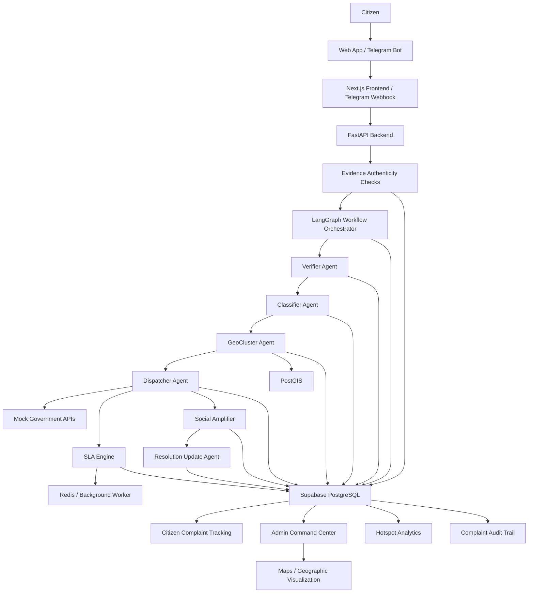
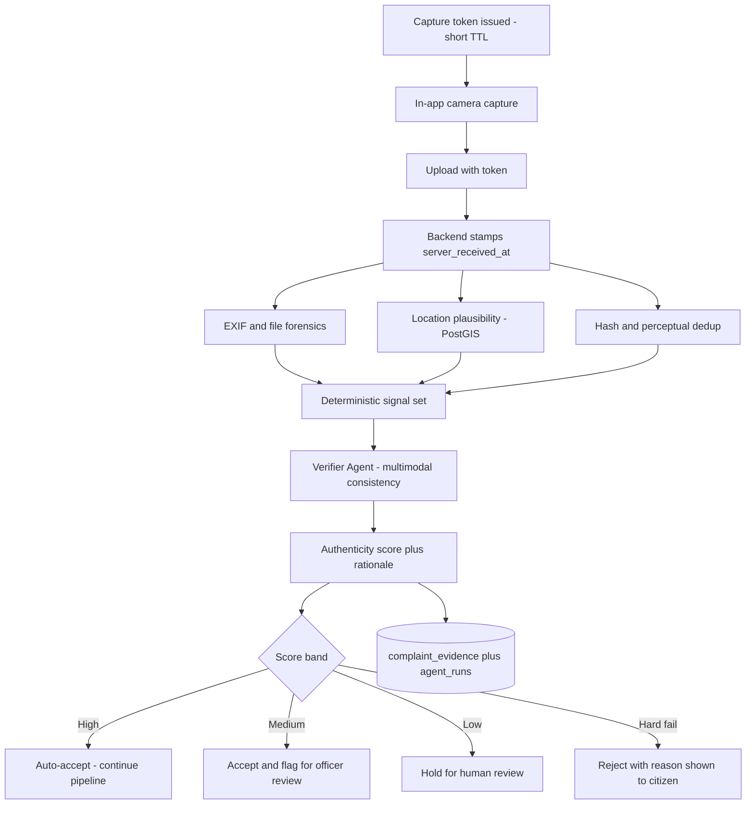

# BarathSeva AI — Autonomous Civic Complaint Intelligence Platform


BarathSeva AI is an AI-powered civic complaint intelligence platform that lets citizens report civic problems — potholes, water leaks, drainage issues, streetlight failures, power outages — using nothing more than a natural-language message, a photo, and a location.

Instead of forcing citizens to navigate multiple government portals and manually work out which department should receive a complaint, BarathSeva AI processes the report automatically. The system verifies the complaint, understands and classifies the issue, identifies the geographic ward and nearby complaint clusters, determines the responsible government department, creates a service ticket, starts SLA tracking, detects hotspots, and generates public accountability updates.

The prototype targets **Bengaluru** first and is architected so it can later scale to other Indian cities.

> **One citizen message should be enough to start the complete civic complaint workflow.**

> **Repository status.** The prototype is implemented and runs end to end: FastAPI + LangGraph backend, Next.js command center, PostgreSQL/PostGIS, Redis/Celery, and the evidence authenticity engine, verified by 86 passing tests against a real PostGIS database. Government connectivity is **mock BBMP / BWSSB / BESCOM endpoints** — there are no real municipal integrations. The default AI provider is a **deterministic rule engine**, so the platform runs with no API keys; set `BARATHSEVA_AI_PROVIDER` to use a real model. See [Running the prototype](#running-the-prototype).

---

## 1. Problem Statement

### Citizen-side problems

Citizens routinely encounter civic issues in their immediate surroundings:

- potholes and road damage
- water leaks and burst pipelines
- drainage and sewage problems
- garbage accumulation
- streetlight failures
- electricity and power outages
- other local infrastructure faults

Reporting these issues, however, is fragmented across departments and channels. Roads, water, drainage, waste, and electricity are typically owned by different agencies, each with its own portal, helpline, app, or walk-in process. Before a citizen can report anything, they are implicitly asked to perform a triage task that belongs to the government: *which authority owns this problem?*

Even once a channel is chosen, the citizen is usually asked to translate what they can plainly see into a structured form — category dropdowns, ward identifiers, zone codes, address fields — and after submission they often have limited visibility into what happened next.

The core problem is therefore not complaint *submission*. Forms and helplines already exist. The missing piece is a **single intelligent complaint-to-resolution pipeline**: one entry point that absorbs an unstructured citizen report and carries it, end to end, through verification, classification, geographic mapping, departmental routing, ticketing, SLA monitoring, and resolution communication.

### Government-side problems

On the administrative side, handling a single complaint can involve a long chain of manual steps:

- receiving reports across multiple intake channels
- manually reading and interpreting free-text or verbal descriptions
- identifying which department is actually responsible
- determining the responsible ward or zone from an address or landmark
- routing the complaint to the right team
- following up on tickets that have not progressed
- tracking SLA deadlines and escalating breaches
- recognising that several reports describe the same recurring problem in the same locality

A further cost sits underneath all of this: not every incoming report is actionable. Some are empty or unintelligible, some attach no usable evidence, some are duplicates of a complaint already in progress, and some are simply not civic issues. Separating these from genuine reports is itself manual work, and every hour spent on an unactionable report is an hour not spent on a real one.

Each step is individually small and individually error-prone. Together they create significant operational overhead, and because the work is spread across channels and departments, it is difficult to maintain a **unified, current view of civic issues across a city** — the view required to spot hotspots, allocate crews, or measure where service is failing.

### Transparency problem

Complaint transparency is usually all-or-nothing. After submitting a report, a citizen generally needs — and often cannot easily get — answers to a short, concrete list of questions:

- Was the complaint received?
- Was it verified as a genuine civic issue?
- Which department now owns it?
- What is the ticket or reference number?
- What is the current status?
- What is the SLA deadline for this category of issue?
- Has the issue actually been resolved?

Without durable answers to these, accountability depends on persistence rather than on the system. Status that cannot be observed cannot be trusted, and a complaint whose state is invisible is indistinguishable from a complaint that was never filed.

### The BarathSeva AI solution

BarathSeva AI converts an unstructured citizen report into a tracked, routed, deadline-bound municipal work item:

```text
Citizen report → Verified complaint → Classification → Geographic mapping
    → Department routing → Ticket → SLA monitoring → Resolution
```

The citizen supplies what they naturally have — a sentence, a photo, a location. The platform supplies everything the government process requires: validity assessment, category and severity, ward resolution, cluster and hotspot context, the responsible department, a service ticket, an SLA clock, escalation on breach, and a public, auditable record of state changes.

---

## 2. Solution Overview

A complaint enters through the web app or a Telegram bot, is received by the FastAPI backend, and is then carried through a LangGraph workflow composed of specialized nodes. Every node writes its decision and output to PostgreSQL, which is the system's source of truth and the substrate for citizen status views, the admin dashboard, hotspot analytics, and the audit trail.

```text
Citizen
   |
   | Text + Photo + Location
   v
Web / Telegram
   |
   v
FastAPI Backend
   |
   v
LangGraph Workflow
   |
   +--> Verifier
   |
   +--> Classifier
   |
   +--> GeoCluster
   |
   +--> Dispatcher
   |
   +--> Social Amplifier
   |
   +--> Resolution Update
   |
   +--> SLA Monitor
   |
   v
Supabase PostgreSQL + PostGIS
   |
   +--> Citizen Status
   +--> Admin Dashboard
   +--> Hotspot Analytics
   +--> Audit Trail
```

The important architectural choice is that this is a **controlled workflow of specialized agents and service nodes**, not a single LLM given free rein over the system. Each node has one narrow job, a defined input and output contract, and a recorded result. The workflow graph — not a model's improvisation — decides what runs next, so complaint handling is reproducible, inspectable, and safe to operate on real municipal data.

> **LangGraph handles orchestration, AI models provide reasoning, Python handles deterministic business rules, and PostgreSQL/PostGIS acts as the source of truth.**

---

## 3. System Architecture



### Component responsibilities

**Citizen intake — Web App / Telegram Bot.** Two entry points over one backend contract. The Next.js web app handles browser reporting and complaint tracking; the Telegram bot serves citizens who would rather send a message than install anything. Both collect the same payload — text, optional photo, location — and both normalise into a single complaint intake schema, so intake channels can be added later without touching the pipeline.

**Next.js frontend / Telegram webhook.** The frontend renders the citizen reporting flow, complaint status pages, and the admin command center. The Telegram webhook is a thin translation layer from Telegram update objects into the same intake call the web app makes.

**FastAPI backend.** The single API surface and trust boundary. It validates and coerces incoming payloads with Pydantic models, persists the uploaded photo, creates the initial complaint row, assigns the public complaint reference, and hands execution to the workflow orchestrator. Authorization, rate limiting, and request validation belong here rather than inside the agents.

**LangGraph workflow orchestrator.** The control plane. It defines the complaint-processing graph — which node runs, in what order, under which conditions — and carries typed state between nodes. Because the graph is explicit, a complaint's path is deterministic and replayable: the same state produces the same traversal, and a failed or low-confidence node can route to a fallback edge instead of stalling the complaint.

**Evidence authenticity checks.** A deterministic pre-pipeline stage in the backend that establishes what can be known about the submitted evidence without asking a model: the server-authoritative receipt time, the capture token the photo was uploaded against, EXIF and file forensics, GPS accuracy and ward containment, and exact plus perceptual image hashes for reuse detection. It produces a structured signal set rather than a verdict. Section 5 documents this in full.

**Verifier agent.** The first judgment gate. It reads the text and image together — alongside the deterministic signal set from the evidence stage — and decides whether the report describes a genuine civic issue backed by sufficient evidence to act on. Its job is to keep noise, invalid duplicates, and empty submissions out of the municipal queue, and to record *why* it decided what it decided, with a confidence value that determines whether the complaint proceeds automatically or waits for a human.

**Classifier agent.** Determines the complaint category (pothole, water leak, drainage, garbage, streetlight, power outage, and so on) and assigns a severity/priority. The model proposes; deterministic business rules constrain the final value, so priority remains explainable and consistent with policy rather than varying with phrasing.

**GeoCluster agent.** Resolves the submitted coordinates to a ward using PostGIS boundary containment, then queries for nearby complaints within a radius and time window to attach cluster context: how many related reports exist, whether this location is a repeat offender, whether it qualifies as a hotspot. The geometry is computed in the database; AI is used only to summarise the resulting picture in human terms.

**Dispatcher agent.** Maps the resolved category and ward to the responsible department (for Bengaluru: BBMP for roads and solid waste, BWSSB for water and sewerage, BESCOM for electricity), then creates the service ticket against that department's API and stores the returned reference. This is deterministic rule and integration logic — a department mapping must never be a guess.

**Mock government APIs.** Stand-in services that emulate municipal ticketing endpoints for the prototype, so the full lifecycle can be demonstrated end to end without depending on live government systems. They sit behind the same interface real integrations would implement.

**SLA engine + Redis / background worker.** On dispatch, the SLA engine computes a deadline from the SLA policy for that category and priority, and schedules the checks. The background worker wakes on those deadlines, re-reads complaint state, and escalates anything overdue. Timers and escalation thresholds are pure application logic.

**Social amplifier.** For complaints that meet defined eligibility rules — severity, cluster size, SLA breach — it drafts public accountability content. Policy rules decide *whether* a post is warranted; the model only decides *how to word it*.

**Resolution update agent.** When a complaint closes, it generates the citizen-facing and public resolution message, so the loop ends with a readable explanation of what was done rather than a bare status code.

**PostGIS.** Powers every geospatial operation: ward boundary lookup, radius search for nearby complaints, and hotspot aggregation. Keeping spatial logic in the database means the same geometry answers the pipeline, the dashboard, and the analytics views.

**Supabase PostgreSQL.** The source of truth. Every complaint, state change, and agent decision is persisted here; no pipeline state lives only in memory or only in a model's context. Supabase Realtime pushes changes to subscribed clients, which is what makes the admin view update live.

**Citizen complaint tracking.** The public-facing read of a complaint's record: reference number, verification outcome, assigned department, status, SLA deadline, and resolution — the transparency list from the problem statement, answered from stored state.

**Admin command center + maps.** The operational view for officials: incoming complaints, filters by ward, department, category, priority and SLA status, escalations, and a geographic visualization of open issues and clusters.

**Hotspot analytics.** Aggregate spatial and temporal queries that surface recurring problem locations — the view that turns a stream of individual complaints into actionable maintenance signal.

**Complaint audit trail.** An append-only event history per complaint, plus a record of every agent run. Any state a citizen or officer sees can be traced back to the decision that produced it.

---

## 4. Specialized Agent Architecture

| Component               | Responsibility                                                                       | AI / Deterministic                  |
| ----------------------- | ------------------------------------------------------------------------------------ | ----------------------------------- |
| Pipeline Manager        | Controls complaint workflow                                                          | Deterministic / LangGraph           |
| Evidence Checker        | Binds capture to server time, runs EXIF/geo/hash forensics, scores evidence integrity | Deterministic                        |
| Verifier Agent          | Determines whether the report contains a genuine civic issue and sufficient evidence | AI                                  |
| Classifier Agent        | Identifies complaint category and severity                                           | AI + business rules                 |
| GeoCluster Agent        | Maps coordinates to ward and identifies nearby complaints/hotspots                   | PostGIS + optional AI summarization |
| Dispatcher Agent        | Determines responsible department and creates service ticket                         | Deterministic rules + APIs          |
| SLA Monitor             | Tracks deadlines and escalates overdue complaints                                    | Deterministic                       |
| Social Amplifier        | Generates public accountability content for eligible complaints                      | AI + policy rules                   |
| Resolution Update Agent | Generates citizen/public resolution messages                                         | AI                                  |

Not every "agent" in this architecture needs to be an LLM, and treating them uniformly would be a design error. An agent here is a node with a single responsibility and a recorded output; whether it reaches that output by model inference, a SQL query, or a rule table is an implementation detail chosen per node.

> Geographic calculations, SLA timers, department mappings, ticket creation, and escalation rules should be enforced by deterministic application logic.

A ward boundary is a polygon containment test, not an opinion. An SLA deadline is arithmetic. A department mapping is a lookup that must be correct every time, because a misrouted complaint is worse than an unrouted one. Reserving AI for genuinely ambiguous, unstructured judgment — and keeping it out of anything that must be exact, auditable, or legally defensible — is what makes the pipeline trustworthy enough to run unattended.

---

## 5. Complaint Authenticity & Evidence Verification

A civic pipeline that dispatches work crews on the strength of a citizen message needs some basis for believing the message. This section documents how BarathSeva AI establishes that a report describes a real issue, at a real place, at a real time.

### Why a timestamped photo is necessary but not sufficient

Requiring a photo with a timestamp is the right instinct, and it is the foundation of the design. But a timestamp supplied by the client cannot be trusted on its own:

- EXIF `DateTimeOriginal` is an ordinary writable metadata field — editable with free tools in seconds.
- A screenshot, a downloaded news photograph, or a year-old photo from the gallery can all be submitted carrying a plausible timestamp.
- Device clocks can be changed, and photos can be re-encoded to strip or rewrite metadata entirely.

So the architecture never treats a client-asserted time or place as fact. Instead it **binds the capture to the server** and then corroborates that binding with independent signals. The design goal is explicit: *raise the cost of fabricating a report high enough that it stops being worth doing, and make every acceptance decision auditable afterwards.* It is not cryptographic proof, and the documentation does not claim it is.

One bias is deliberate. Falsely rejecting a real pothole is a worse failure than processing an occasional fake one, because the first breaks citizen trust in the platform and the second costs an inspection. Weak signals therefore reduce an authenticity score and route a complaint toward human review — they do not silently reject it. Outright rejection is reserved for hard failures.

### Layer 1 — Server-bound capture (the primary control)

```text
Client requests capture token  →  Backend issues short-TTL signed token
                                  (issue time, user, device, GPS fix)
                                              ↓
                              In-app camera capture
                                              ↓
                       Upload must present the same token
                                              ↓
              Backend stamps authoritative server_received_at
```

- **Signed capture token.** Before the camera opens, the client requests a short-lived signed token from the backend. The token embeds its own issue time, the user and device identity, and the GPS fix at the moment of issue. The upload is rejected if it does not present a valid, unexpired, unused token.
- **Server-authoritative receipt time.** `server_received_at` is recorded by the backend, never sent by the client. This is the timestamp the system actually reasons about.
- **In-app camera preferred over gallery.** Captures taken through the app's camera are marked `source=camera`; gallery uploads are still accepted — a citizen who photographed a flooded street an hour ago should not be turned away — but are marked `source=gallery` and carry a lower evidence weight.

The effect is a server-enforced upper bound on the age of the evidence: a photo uploaded against a token issued three minutes ago cannot be an old image unless it was deliberately staged on the device beforehand. That is a far higher-effort attack than editing a metadata field, which is precisely the point.

### Layer 2 — EXIF and file forensics (corroborating signals)

Each signal below is individually weak and individually forgeable. Their value is in aggregate, and in being permanently recorded for audit.

| Signal | What a mismatch suggests |
| ------ | ------------------------ |
| EXIF `DateTimeOriginal` vs `server_received_at` | A large delta means the image predates the reporting session |
| EXIF GPS vs device-reported GPS | The photo was taken somewhere other than where it is being reported |
| EXIF block absent or stripped | Screenshot, re-encode, messaging-app forward, or web download |
| `Software` / editing tags present | The image passed through an editor |
| Device make and model vs session device | The image did not originate on the reporting device |
| Dimensions and aspect ratio | Values matching common screen sizes suggest a screenshot |
| JPEG quantization tables and re-encode traces | Indicates the image is not camera-original |

### Layer 3 — Location plausibility (deterministic, PostGIS)

- **GPS accuracy threshold.** Fixes with an accuracy radius beyond a configured limit are flagged, since a 500-metre-accurate fix cannot support a ward assignment or a pothole location.
- **Ward containment.** PostGIS tests whether the point falls inside a serviced ward boundary. Reports outside the city's jurisdiction are flagged and explained to the citizen rather than routed to a department that cannot act.
- **Mock-location detection.** Where the platform exposes it, the OS-level mock-location indicator is captured as a signal.
- **Reporter velocity check.** Successive reports from one account at locations too far apart to have been physically travelled in the elapsed time are flagged.
- **Reverse-geocode coherence.** If the text names a locality, it is compared against the reverse-geocoded coordinates; "pothole in Indiranagar" reported from Whitefield is a flag, not a rejection.

### Layer 4 — Duplicate and image-reuse detection

- **SHA-256 content hash** catches byte-identical files re-submitted across complaints or accounts.
- **Perceptual hash (pHash/dHash) with a Hamming-distance threshold** catches the same scene after rescaling, cropping, light editing, or re-encoding — the common case that an exact hash misses.
- **Reuse across locations or accounts.** A perceptual match between complaints at distant coordinates, or from unrelated accounts, is a strong abuse signal.
- **Text near-duplicate detection** via embedding similarity catches copy-pasted report bodies.

One distinction matters here and is easy to get wrong. A duplicate **image** is an abuse signal. A duplicate **independent report of the same issue** is the opposite — it is corroboration, and the strongest authenticity evidence the system can get. The two are separated by comparing image hashes and reporter identity, not location alone: six different people photographing the same pothole from six angles should raise confidence and priority, while one photo submitted six times should not.

### Layer 5 — Multimodal consistency (Verifier agent, AI)

This is where AI does the work no rule can: judging whether the image and the words actually agree.

- Does the image depict the category the text claims?
- Does it depict a civic issue at all, as opposed to a selfie, a meme, an indoor scene, or a blank frame?
- Is the scene plausible for the location type — an outdoor road surface for a pothole, for instance?
- Does the visible severity support the claimed severity?

The agent returns a confidence value and a natural-language rationale, and both are persisted. The rationale is what makes an automated rejection explainable to the citizen who received it.

### Layer 6 — Corroboration and reporter reputation

- **Independent corroboration.** The GeoCluster agent already computes nearby complaints; distinct accounts and devices reporting the same issue in the same cluster raise the authenticity score.
- **Neighbour confirmation.** Citizens near a reported location can confirm the issue exists, converting a single report into a corroborated one.
- **Field outcome as ground truth.** When a department closes a ticket, the recorded outcome — genuine and fixed, or not found — is the only true label the system ever gets. It feeds reporter trust scores and, later, model evaluation.
- **Reporter trust score.** A per-user score that rises with confirmed-genuine reports and falls with rejected ones. New accounts start neutral and are weighted lower, not blocked, so a first-time reporter is never turned away. Phone or Telegram verification establishes identity, and per-user, per-device rate limits cap submission velocity.

### Layer 7 — Tamper-evident record (integrity, not authenticity)

- The image's SHA-256 hash is stored at intake, so any later substitution of the evidence is detectable.
- `complaint_events` entries are hash-chained, making the audit trail tamper-evident: a state change cannot be backdated or quietly rewritten.

These two controls prove that **the record was not altered after intake**. They do not prove the photo depicts what it claims — that is Layers 1–6. The guarantees are different and both are needed, and conflating them is a common mistake in systems that advertise "blockchain-verified" complaints.

Looking ahead, **C2PA Content Credentials** offer hardware-attested capture provenance signed at the sensor, which is a genuinely stronger primitive than anything above. Device and OS support is still limited, so it is recorded here as roadmap rather than as an available control.

### Authenticity scoring and graduated outcomes



Signals are combined into a single authenticity score with a stored breakdown, and the score selects an outcome band:

| Band | Outcome |
| ---- | ------- |
| High | Proceeds automatically through the pipeline |
| Medium | Proceeds, flagged for officer attention in the dashboard |
| Low | Held in a human-review queue before dispatch |
| Hard fail | Rejected, with the reason returned to the citizen |

Hard failure is reserved for unambiguous cases: no civic content in the evidence, coordinates outside the serviced area, a missing or expired capture token, or an image already known to have been reused. Everything softer degrades the score instead.

### Prototype scope

Not all seven layers need to exist to demonstrate the idea. The high-value, low-cost subset for the prototype is:

```text
In-app camera capture + signed capture token
Server-authoritative server_received_at
EXIF timestamp and GPS delta checks
GPS accuracy threshold + PostGIS ward containment
SHA-256 + perceptual hash duplicate detection
AI image-text consistency check with stored rationale
Authenticity score with human-review routing
```

Reporter reputation maturity, neighbour confirmation, velocity analysis, and C2PA are deferred to production. None of the controls in this section should be read as already implemented.

---

## 6. Technology Stack

### Frontend
- Next.js
- TypeScript
- Tailwind CSS

### Backend
- FastAPI
- Python
- Pydantic

### AI Orchestration
- LangGraph

### AI Models
- OpenAI or Gemini multimodal models
- The model layer is kept provider-agnostic where practical, so providers can be swapped per node without pipeline changes

### Database
- Supabase
- PostgreSQL
- PostGIS

### Background Processing
- Redis
- Celery or an equivalent background worker

### Realtime
- Supabase Realtime

### Messaging
- Telegram Bot API

### Maps
- Mapbox or Google Maps

### Storage
- Supabase Storage

### Prototype Integrations
- Mock BBMP API
- Mock BWSSB API
- Mock BESCOM API

Government connectivity in the prototype is served entirely by mock APIs. Real municipal integrations with BBMP, BWSSB, BESCOM, or any other agency are a **future production-stage concern** and are not represented as integrated; they require formal access, credentials, and agreements that this project does not claim to hold.

---

## 7. End-to-End Complaint Lifecycle

```text
Citizen:
"Large pothole near Koramangala 5th Block"

+ Photo
+ GPS coordinates

        ↓

Complaint Created
BRS-000001

        ↓

Evidence Checks
Capture token valid
EXIF time within window
GPS accuracy 8 m, inside ward
No duplicate image match

        ↓

Verifier
Valid civic issue
Authenticity: high

        ↓

Classifier
Category: POTHOLE
Priority: P2

        ↓

GeoCluster
Ward: Koramangala
Nearby complaints: 6

        ↓

Dispatcher
Department: BBMP
Ticket: BBMP-XXXX

        ↓

SLA Monitor
SLA deadline created

        ↓

Admin Dashboard
Complaint visible in real time

        ↓

Issue resolved

        ↓

Resolution Update
Citizen receives resolution status
```

Identifiers such as `BRS-000001` and `BBMP-XXXX`, along with the ward name, nearby-complaint count, priority, and evidence-check values shown above, are **illustrative examples only** — they demonstrate the shape of the lifecycle, not recorded results.

What the walkthrough shows is the scope of what a single sentence plus a photo sets in motion: the citizen performs one action, and verification, categorisation, ward resolution, cluster analysis, departmental routing, ticket creation, deadline tracking, and resolution notification all follow without further human triage.

---

## 8. Data Architecture

```text
users
complaints
complaint_evidence
complaint_events
agent_runs
departments
wards
sla_policies
social_posts
```

| Entity | Purpose |
| ------ | ------- |
| `users` | Citizens and administrative users — identity, verification state, contact channel (including Telegram), role, and reporter trust score. |
| `complaints` | The primary complaint record: description, media reference, location, category, priority, ward, assigned department, external ticket reference, status, and SLA deadline. |
| `complaint_evidence` | Per-submission evidence record: capture token reference and source (camera or gallery), `server_received_at`, extracted EXIF payload, GPS accuracy and mock-location flag, SHA-256 and perceptual hashes, individual authenticity signals, and the resulting score. |
| `complaint_events` | Append-only history of everything that happened to a complaint — created, verified, classified, routed, escalated, resolved — with actor and timestamp. |
| `agent_runs` | One row per agent/node execution: input state, output, confidence, status, latency, and model or rule version used. |
| `departments` | Municipal agencies and the categories they own, forming the routing table the dispatcher resolves against. |
| `wards` | Ward and zone records with geographic boundary geometry. |
| `sla_policies` | Resolution deadlines and escalation thresholds per category and priority. |
| `social_posts` | Public accountability content generated for eligible complaints, with its publication state. |

Key properties of this model:

- **`complaints` is the primary complaint record** — the single row every view, ticket, and notification refers back to.
- **`complaint_events` maintains an audit trail** — an append-only log, so complaint history is reconstructable and status is never a value whose origin is unknown.
- **`agent_runs` records agent decisions, status, latency, and outputs** — making the pipeline observable: which node decided what, how confident it was, how long it took, and what it emitted.
- **`wards` contains geographic boundaries** — authoritative ward geometry, so ward assignment is a spatial fact rather than a parsed address string.
- **PostGIS handles geospatial queries** — boundary containment, radius searches for nearby complaints, and hotspot aggregation all execute in the database.
- **`complaint_evidence` holds the authenticity signal set** — stored per submission so an acceptance or rejection can be re-explained later from the exact signals that produced it, and so duplicate detection has a hash corpus to query against.
- **`sla_policies` contains deterministic SLA rules** — deadlines are derived from stored policy, so they are consistent, explainable, and changeable without touching pipeline code.

---

## 9. Design Principles

### AI for reasoning

AI handles the parts of the problem that are genuinely unstructured:

- natural-language understanding
- image interpretation
- image-to-text consistency judgment
- complaint classification
- summarization
- public-message generation

### Code for enforcement

Application logic owns everything that must be exact and repeatable:

- SLA calculation
- department mapping
- geographic calculations
- capture-token issuance and validation
- evidence forensics and authenticity scoring
- duplicate and image-reuse detection
- authorization
- ticket creation
- state transitions
- escalation rules

### Database as source of truth

All complaint states and events are persisted in PostgreSQL. No pipeline state exists only in process memory or only in a model's context; if it matters, it is a row.

### Auditable agents

Every important AI decision is recorded in `agent_runs` or `complaint_events`, with its inputs, output, and confidence — so any outcome can be explained after the fact rather than reconstructed by guesswork.

### Evidence over assertion

Nothing the client claims about time or place is treated as fact. Capture is bound to a server-issued token and a server-recorded timestamp, and every authenticity signal is stored rather than collapsed into a pass/fail bit — see Section 5.

### Human fallback

The architecture supports a future manual-review path for low-confidence or ambiguous complaints. Confidence and authenticity scores are captured per submission specifically so that such complaints can be routed to a human queue instead of being force-decided by a model. The platform errs toward accepting and reviewing a doubtful report rather than rejecting a real one.

---

## 10. Prototype vs Production

### Prototype

```text
Next.js
FastAPI
LangGraph
OpenAI/Gemini
Supabase
PostGIS
Redis
Mock government APIs
Telegram
```

The prototype's goal is to demonstrate the **complete autonomous complaint lifecycle** — intake through verification, classification, geographic mapping, routing, ticketing, SLA tracking, and resolution — on a realistic stack, with government connectivity mocked.

### Production

Future enhancements may include:

- real municipal integrations
- stronger authentication and authorization
- production queues
- advanced observability
- model evaluation
- hardware-attested capture provenance via C2PA Content Credentials
- mature reporter reputation and fraud/spam detection
- scalable notification infrastructure
- stronger security controls
- human review workflows
- city-specific department and ward configuration
- multi-city deployment

None of these production capabilities exist today. They are listed as the roadmap between a working prototype and a system a municipality could operate.

---

## Architecture Summary

```text
Next.js
   ↓
FastAPI
   ↓
LangGraph
   ↓
Specialized AI + deterministic service nodes
   ↓
PostgreSQL + PostGIS
   ↓
Realtime dashboards / notifications / analytics
```

BarathSeva AI is an **autonomous civic complaint orchestration platform** — not a chatbot, and not a complaint form. A chatbot answers a question; a form captures a submission. BarathSeva AI takes one unstructured citizen message and drives the entire municipal workflow behind it: establishing that the evidence is authentic, verifying the issue, classifying it, locating it in a ward, clustering it with related reports, routing it to the responsible department, opening a ticket, holding that ticket to an SLA, escalating breaches, and closing the loop with the citizen — with every decision along the way persisted and auditable.

---

## Running the prototype

### Requirements

| Tool | Why |
| ---- | --- |
| Docker | PostgreSQL 15 + PostGIS 3.4 and Redis 7 run as containers |
| Python 3.11+ | FastAPI, LangGraph, Celery |
| Node 18+ | Next.js 16 frontend |

No API keys are required. The platform ships with a deterministic rule-based AI
provider and mock government endpoints, so a clean checkout runs offline.

### Quick start

```bash
make setup     # create the venv, install backend + frontend dependencies
make db        # start PostGIS + Redis, create the schema, seed reference data
make api       # terminal 1 — FastAPI on http://localhost:8000
make web       # terminal 2 — Next.js on http://localhost:3000
```

Then open:

| URL | What it is |
| --- | ---------- |
| `http://localhost:3000` | Citizen reporting flow (in-app camera capture) |
| `http://localhost:3000/track` | Complaint tracking by reference |
| `http://localhost:3000/admin` | Admin command center — map, filters, live feed |
| `http://localhost:3000/admin/hotspots` | Hotspot analytics and generated content |
| `http://localhost:8000/docs` | Interactive OpenAPI documentation |
| `http://localhost:8000/health` | What is actually wired up right now |

`/health` is deliberately honest: it reports the active AI provider, whether it
is a real model, whether Telegram is configured, and that the government APIs
are mocks — so a running demo cannot misrepresent itself.

### See the whole lifecycle in one command

```bash
make demo
```

This rebuilds the database and drives the real HTTP API through every branch
the architecture claims to have: a clean capture, corroboration building into a
hotspot, all three department routes, each class of evidence hard failure
(reused image, out-of-area coordinates, missing and replayed capture tokens),
the degraded paths (stale edited photo, spoofed GPS), verifier rejection of
non-civic noise, an SLA breach with escalation and amplification, and
resolution with the citizen message.

### Background SLA processing

The SLA sweep is the one part that must run without anyone triggering it —
deadlines pass on their own.

```bash
make worker    # Celery worker
make beat      # Celery beat — sweeps every 5 minutes
```

The same sweep is exposed as `POST /api/admin/sla/sweep` (and a button in the
command center) so the lifecycle can be demonstrated without a worker running.

### Tests

```bash
make test      # 86 tests
```

The suite runs against a real PostGIS database (`barathseva_test`, created
automatically), not a mock. The geospatial logic *is* the behaviour under
test — ward containment, radius search and DBSCAN clustering have no
meaningful in-memory substitute, so a fake would only prove the fake works.

### Using a real model

```bash
export BARATHSEVA_AI_PROVIDER=openai
export BARATHSEVA_OPENAI_API_KEY=sk-...
pip install -r backend/requirements-ai.txt
```

Gemini works the same way with `BARATHSEVA_AI_PROVIDER=gemini`. If a configured
provider is unusable — missing SDK, missing key, or a failing call — the
platform falls back to the deterministic provider rather than dropping the
complaint. Intake never depends on a third party being up; classification
quality degrades instead.

### Configuration

Every policy threshold in Section 5 is environment-configurable with the
`BARATHSEVA_` prefix — capture-token TTL, EXIF tolerances, GPS accuracy limits,
perceptual-hash bands, authenticity score bands, cluster radius and the hotspot
threshold. See [`backend/.env.example`](backend/.env.example) for the full list
with defaults. `GET /api/config` serves the same values to the frontend, so the
UI explains the thresholds the backend actually enforces instead of keeping its
own copy.

---

## Project structure

```text
backend/
  app/
    main.py              FastAPI app — the single API surface and trust boundary
    config.py            Environment-driven settings; every policy threshold
    models.py            SQLAlchemy models — the source of truth
    schemas.py           Pydantic request/response contracts
    seed.py              Idempotent wards / departments / SLA policies
    core/
      authenticity.py    Evidence engine: Layers 1-4 and 6, plus scoring
      security.py        HMAC capture tokens (Layer 1)
      exif.py            EXIF and file forensics (Layer 2)
      geo.py             PostGIS containment, radius search, DBSCAN hotspots
      hashing.py         SHA-256, dHash perceptual hashing, audit hash chain
      sla.py             Deadline arithmetic from stored policy
      departments.py     Deterministic category -> department routing
      events.py          Append-only, hash-chained audit trail
      city.py            Bengaluru ward/department configuration
    ai/
      base.py            Provider-agnostic inference contract
      stub.py            Deterministic provider — runs with no API key
      openai_provider.py / gemini_provider.py / factory.py
      prompts.py         Prompt construction for model-backed providers
    agents/              verifier, classifier, geocluster, dispatcher,
                         sla_monitor, social, resolution
    workflow/graph.py    LangGraph orchestration with human-review edges
    services/intake.py   Intake: evidence -> persistence -> pipeline
    integrations/        Mock BBMP/BWSSB/BESCOM gateway, Telegram client
    worker/              Celery app and the SLA beat schedule
  scripts/
    init_db.py           Schema + seed
    demo_lifecycle.py    End-to-end demonstration over the real API
    make_test_photo.py   Synthetic JPEGs with real EXIF for testing
  tests/                 86 tests against real PostGIS

frontend/
  app/                   Citizen report, tracking, command center, hotspots
  components/            Report form, evidence panel, map, live feed
  lib/                   API client, types, formatting
```

---

## License

Released under the [MIT License](LICENSE).
